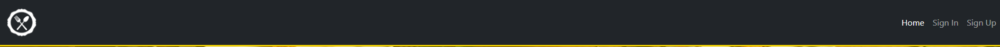
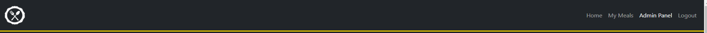

# MealPin

MealPin is a web application designed for users to visit and pin recipes that they like. It was inspired by Pinterest and is created to be used either as a dietary aide, a way of sharing recipes and a means of learning new recipes.

Unregistered users can view a call to action page that encourages them to sign up. Users can sign up for the site from the registration form. They can then subsequently log in using the login button in the navigation bar. 

Registered users can view the Home page, which is a grid of "meal cards". A meal card contains a title, brief dietary information and preparation time. The user can then pin the card to add it to their "My Meals", thus pinning it and letting them save it for later. A user can also unpin meals in the same manner by clicking on the meals that are pinned. The pin changes from an outline when unpinned to a solid background when pinned. The user can also click on the "info" button and see the information from the meal card expanded to display the meal's type, full dietary information and recipe. Registered users can click on "My Meals" to get a list of the meals they have pinned. This page also contains the "info button" functionality. 

Creation, Reviewing, Updating and Deleting Meals are controlled from the admin panel, restricting who can create, update and delete meals from the site. The admin user can get to the admin panel in the navigation bar as long as they are logged onto their administration account. Administrators can also pin and unpin meals like regular users. 


The live site can be found here: [MealPin](https://recipe-pinner-fe5a291f89dd.herokuapp.com/)

# Table of Contents
- [User Experience](#user-experience)
- [Features](#features)
  - [General](#general)
  - [Site Pages](#site-pages)
  - [Regisration](#accounts)
- [Design](#design)
- [Technologies Used](#technologies-used)
- [Testing](#testing)
- [Deployment](#deployment)
- [Credits](#credits)

# User Experience

### User Stories

The user stories used as part of the planning for the website have been consolidated here.

- As a Site User I can view the home page so that I can see the site's goal and be encouraged to sign up
- As a Site User I can register for an account so that I can log in to gain access to the site's features
- As a Site User I can log in so that I can gain access to the site's features
- As a Site User I can Log Out so that I can let someone else log in on my computer, leave myself signed out on public spaces or change accounts
- As a Site User I can view the Home page when logged in so that I can pin meals
- As a Site User I can view my pinned meals so that I can see what I've saved
- As a Site User I can Click on the highlighted 'pin' to unpin a meal-card so that it is removed from "My Meals"
- As a Site User I can Click on the 'pin' to pin a meal-card so that it is added to "My Meals"
- As a Site User I can Click on the Info button so that I can expand the Meal Card and view the recipe in more detail
- As a Site User I can unpin meals on the My Meals page so that they are removed from the page, and the page automatically updates
- As a Site Administrator I can view administrator features so that I can add, edit and remove meal cards to the site
- As a Site Administrator I can view the meal CRUD Forms so that I can add, edit and remove meals from the site
- As a Developer I can create a model for the Meal database so that it is available for administrators to add meals
- As a Developer I can automatically generate a list of a User's pinned meals so that when they go to the "My Meals" page it only displays the meals they have pinned
- As a Developer I can create a model for the Pinned Meal database for each user so that we can generate a list of pinned meals for each user

# Features
## General
### Navigation Bar

<details>
<summary>Navbar</summary>




</details>

The navigation bar is featured across all pages.

For unregistered or logged out users of the site, the navbar displays Home, Login and Sign Up. The list collapses into a dropdown menu on smaller screens which can be toggled by clicking the bars icon.

For registered users of the site, the navbar displays Home, My Meals and Log Out. Administration accounts would also see the "Admin Panel" option. 

The navbar is based on the standard bootstrap 5 navbar in dark, with some modifications. 

On the left hand side of the screen, there is the logo which acts as a link to the index page, which renders differently depending on whether the user is logged in or out. 

### Footer

<details>
<summary>Footer</summary>


</details>

The footer is featured across all pages. It is a very simple copyright mark on a contrasting white background that is always visible on scroll down. 

## Site Pages

### Index Page

<details>
<summary>Index Page Unregistered</summary>


</details>

<details>
<summary>Index Page Logged In</summary>


</details>

The index page has two states depending on the user.

For unregistered or logged out users, the index page displays a hero image giving the user an immediate understanding of the nature of the site (it is a food based image). Within this is a box containing a simple and short message with a Call to Action button encouraging the user to sign up. Users can click this button or the sign up in the navigation bar to do so, or log in using the navbar. 

For users who are registered and logged in, the index page displays a grid of meal cards, arranged evenly across the page. These meal cards have a title, preparation time, info button, simple dietary information and a pin button. Users can click the pin to "pin" or "unpin" their meals, which changes the icon accordingly. Clicking the info button will expand the information on the meal card using a dialog so that the user can view the details about that meal. 

The index page is responsive in that the number of meal cards per line adjusts for different device sizes. On very large screens, the content is limited to 2000px wide and is centered. 

### My Meals

<details>
<summary>My Meals</summary>


</details>

The My Meals page is available for registered and logged in users. The primary purpose of the My Meals page is to display only the pinned meals for that user. This gives the user a way of briefly seeing their saved list of meals, without seeing a full list of them. There is an info button present on the meal which allows them to expand into a dialog for more detailed information. There is also a pin on the meal cards but this will only "unpin" meals, as they are then removed from the user's meal list, and not visible on the My Meals page. 

The My Meals page is responsive in that the number of meal cards per line adjusts for different device sizes. On very large screens, the content is limited to 2000px wide and is centered. 


## Accounts

### Registration Page

<details>
<summary>Registration Page</summary>


</details>

The registration page is accessible through a "Sign Up" link in the navbar or "Sign Up" CTA button on the index page for users who are not logged in. The page features a simple form that requires the users "Email", "First Name", "Last Name", "Password" and "Confirm Password". 

If the user attempts to register while leaving any of the fields blank, they are prompted to fill in the missing field. If the user attempts to register with an email that is already registered, they are given a message that the email is already in use. If the user attempts to register without the passwords matching, they are given a message that the password fields don't match. 

When the user registers, they are logged in and redirected to the index page where they can now view all meals.

### Login Page

<details>
<summary>Login Page</summary>


</details>

The login page is accessible through a "Sign In" link in the navbar. The page features a simple form that requires the user's "Email" and "Password". If the user attempts to submit an empty field, they are prompted to fill in the required field. If the user's credentials are invalid, they are given a message that their login is invalid.

When the user logs in, they are redirected to the index page where they can now view all meals.


</details>

The logout option is accessible through a "Logout" link in the navbar. When the user logs out, they are redirected to the index page that displays when the user is logged out, consisting simply of a call to action for signing up and containing a login button on the navbar. 


## Admin Panel

### Admin Panel

<details>
<summary>Admin Panel</summary>


</details>

From the admin panel, the admin user is able to create, update and delete meals. This page displays all meals, and there is a large "Add Meal" button at the top of the page for adding meals. Each meal card contains an edit and delete button, which allows the administrator to execute these actions. When the administrator clicks the "Add Meal" button they are taken to the Create Meal page. When they click the Edit button, they are taken to the Edit Meal page. When they click the Delete Meal button, the meal is deleted and they remain on the Admin page, whilst a message confirms their action. 

### Create Meal

<details>
<summary>Create Meal</summary>


</details>

From the Create Meal page, the admin user is able to create meals. This page consists of a form with the following fields; Title, Meal type, Breakfast, Preptime in minutes, 
Calories in grams, Protein in grams, Fat in grams, Carbs in grams and Recipe. All fields are required, and the Meal Type uses a drop down menu consisting of all the meal categories on the site. Meal Type and Recipe are prepopulated with a default; Meal Type defaults to Breakfast (the first item on the drop down menu), and recipe defaults to "This recipe has not been added yet!". The recipe option uses Django Summernote to give the administrator a text editing tool for creating the recipe information. 

### Edit Meal

<details>
<summary>Edit Meal</summary>


</details>

From the Edit Meal page, the admin user is able to Edit meals. This page consists of a prepopulated form with the following fields; Title, Meal type, Breakfast, Preptime in minutes, Calories in grams, Protein in grams, Fat in grams, Carbs in grams and Recipe. From here, the administrator may edit any of the fields and click save, where they are then redirected back to the admin panel and a message will confirm the successful edit. 

### Delete Meal

<details>
<summary>Delete Meal</summary>


</details>

When the administrator clicks the Delete Meal button, the meal is deleted and they remain on the Admin page, whilst a message confirms their action. 


## Future Features
1. __Reordering of Pinned Items__. In the future it could increase functionality if the user's pinned items moved to the top of the Home page. During development, an attempt was made at implementing this functionality, but resulted in duplication of pinned items. As such, the functionality was judged beyond the scope of the current project.
2. __Pin Transition or Animation__. In the future, having an animation or transition to display that the meal card has been pinned or unpinned would greatly increase the user's experience on the site. However, due to the fact that the Home page is reloaded when a card is pinned or unpinned, this functionality was beyond the means of the developer. 
3. __View other user's Meal Lists__. In the future having users be able to view other user's "My Meals" lists and see what they have pinned, and potentially even comment on them, could expand the functionality of the site greatly. This feature was determined to be way beyond the scope of the original project and no attempt was made to add this in development.


# Design

The concept for MealPin was a site much like Pinterest where users could pin their meals to save them for later and view large lists of meals. As such, the aim of the design was to keep things clear, legible, intuitive to use and pleasing to the eye. The Index page is designed to capture the user's attention and create understanding of the site's purpose, whereas the logged in pages' design is focused on functionality and accessibility. 


## CRUD Functionality

Registered users have the ability to add and remove meals from their "My Meals" list using the pin functionality. These can be pinned and unpinned as many times as the user wishes, and will always update immediately. Administrators have the ability to create, view, edit and delete meals at any time. Deleting a meal creates a cascading effect that removes them from all user's My Meal lists and the full meal list. 


## Colour


The site uses a colour palette of primarily black, beige and white to keep a modern feeling and aesthetic whilst giving as much clarity and accessibility as possible. On the administration panel forms, the background switches from black to white to keep the page as simple and clear as possible, where there is far less focus on aesthetic. On the sign up page, a bright and bold image full of colour is included to grab the user's attention and the sign up button is blue to stand out on the page. Also in the Administration Panel, the Create, Edit and Delete buttons are coloured according to functionality as opposed to for visual appeal.  


## Typography

The site makes extensive use of the sans-serif font family implemented by bootstrap. Despite this being the default, it felt clear, concise and functional for the site, so there was no reason to make any adjustments. In future, changing the font for the word MealPin (the site's name) to make it something more recognizable as a brand could be something to be considered.


## Wireframes

Wireframes were created in Balsamiq. They were used for initial planning of template layouts. I did not include wireframes for forms, as these are mostly generated using Crispy Forms through bootstrap and making very small edits. 

<details>
<summary>Index Wireframe</summary>


</details>

<details>
<summary>Home Wireframe (index when logged in)</summary>


</details>

<details>
<summary>My Meals Wireframe</summary>


</details>

<details>
<summary>Admin Panel Wireframe</summary>


</details>


## Agile Methodology

[GitHub Projects Page]()

GitHub Projects was used in part for the planning of this website to create and track User Stories as they were implemented and fulfilled. The initial plan for the project was to break these user stories down into a small set of sprints, and each individual sprint would cover an Epic. The Site consists of 6 Epics. One is an overriding Epic, which contains the entire project's scope, purpose and functionality. This is then broken down into the 5 other Epics. These consist of User Interface, Authentication, Database, Pin Functionality and Stretch Goals. Each of these Epics was initially planned to be a single sprint, and each of these Epics can be broken down further into User Stories. These User Stories on the project board each contain a label depicting the epic to which they belong, and a label depicting whether they are MVP (Must Have), Extended Functionality (Should Have) or Stretch Goals (May Have). Due to the fact that the entire project was changed fairly late due to difficulties in implementing the original project, and some of the functionality crossed over, the entire site was made in a single sprint fairly close to the deadline date, thus the project board is not split into sprints.


## Entity Relationship Diagram

The below Entity Relationship Diagram was created on [diagrams.net](https://www.diagrams.net/). It illustrates the relationships between the models present in the project: 

<details>
<summary>ERD</summary>


</details>


# Technologies Used

- [HTML5](https://en.wikipedia.org/wiki/HTML5): mark-up language.
- [CSS3](https://en.wikipedia.org/wiki/CSS): styling.
- [JavaScript](https://www.javascript.com/): programming language.
- [Python 3](https://www.python.org/): programming language.
- [Django 3.2](https://www.djangoproject.com/)
  - [Django Crispy Forms](https://pypi.org/project/django-crispy-forms/): for forms.
  - [Crispy Bootstrap5](https://pypi.org/project/crispy-bootstrap5/): bootstrap5 template pack for crispy forms.
- [Bootstrap](https://getbootstrap.com/): styling.
- [Cloudinary](https://cloudinary.com/): store static and media files.
- [GIT](https://git-scm.com/): for version control.
- [GitHub](https://github.com/): for host repository.
- [Gitpod](https://www.gitpod.io/): online IDE.
- [Heroku](https://)
- [Google Fonts](https://fonts.google.com/): to import fonts.
- [Font Awesome](https://fontawesome.com/): to import icons.
- [Balsamiq](https://balsamiq.com/): to create wireframes.
- [Diagrams.net](https://www.diagrams.net/): for Entity Relationship Diagram.
- [Greenshot](https://getgreenshot.org/): for screenshots used in this readme. 

# Testing

Testing for the site can be found at the below link:

[Link to TESTING.md](TESTING.md)


# Deployment
## Steps to deploy site using Heroku:
- Assuming gunicorn, dj_database_url, psycopg2 and dj3-cloudinary-storage have been installed
- On the Heroku dashboard, select "New" and click "Create new app"
  - Create a unique app name - this will be added to allowed hosts in the project settings
  - Select your region
  - Click "Create app"
- Go to the Resources tab:
  - Search for "postgres" in the add-ons search bar and select "Heroku Postgres"
  - Click "Submit Order Form"
- Go to the settings tab:
  - Scroll down to the config vars section and select "Reveal Config Vars"
  - DATABASE_URL will be set after adding Heroku Postgres - this will be copied to the project
  - Add a new config var for SECRET_KEY - create your own or use a django secret key generator
  - Add a new config var for CLOUDINARY_URL - copy the "API Environment variable" from your cloudinary dashboard, remove "CLOUDINARY_URL="
  - Add a new config var for DISABLE_COLLECTSTATIC, with the value 1 - this will be removed before deployment
- In your project, for your environment variables:
  - Create a new env.py file in the top level directory
  - In env.py:
    - Import os
    - Add 'os.environ["DATABASE_URL"] = "Paste the DATABASE_URL from the Heroku app here"'
    - Add 'os.environ["SECRET_KEY"] = "Paste your new secret key here"'
    - Add 'os.environ["CLOUDINARY_URL"] = "Paste your CLOUDINARY_URL as in the Heroku app here"'
  ```
  import os

  os.environ['DATABASE_URL'] = 'postgres://exampledatabaseurl'
  os.environ['SECRET_KEY'] = 'examplesecretkey'
  os.environ['CLOUDINARY_URL'] = 'cloudinary://examplecloudinaryurl'
  ```
  - If not already present, create a .gitignore file and add env.py to it

- In your project, in settings.py:
  - Import os
  - Import dj_database_url
  - if os.path.isfile('env.py'):
	import env
  ```
  import os
  import dj_database_url
  if os.path.isfile('env.py'):
      import env
  ```
  - Replace the insecure secret key with "SECRET_KEY = os.environ.get('SECRET_KEY')"
  ```
  SECRET_KEY = os.environ.get('SECRET_KEY')
  ```
  - Link new database by commenting out old DATABASES section and adding:
	DATABASES = {
			'default': dj_database_url.parse(os.environ.get('DATABASE_URL'))
			}
  ```
  DATABASES = {
        'default': dj_database_url.parse(os.environ.get('DATABASE_URL'))
    }
  ```
  - Add Heroku to the allowed hosts: "ALLOWED_HOSTS = ['the_app_name_from_heroku.herokuapp.com']
  ```
  ALLOWED_HOSTS = ['example-heroku-app-name.herokuapp.com', 'localhost']
  ```
  - Add 'cloudinary_storage' (above 'django.contrib.staticfiles') and 'cloudinary' (below) to INSTALLED_APPS
  ```
  ...
  'cloudinary_storage',
  'django.contrib.staticfiles',
  'cloudinary',
  ...
  ```
  - Setup Cloudinary to store static and media files
  ```
    STATIC_URL = '/static/'
	STATICFILES_STORAGE = 'cloudinary_storage.storage.StaticHashedCloudinaryStorage'
	STATICFILES_DIRS = [os.path.join(BASE_DIR, 'static')]
	STATIC_ROOT = os.path.join(BASE_DIR, 'staticfiles')

	MEDIA_URL = '/media/'
	DEFAULT_FILE_STORAGE = 'cloudinary_storage.storage.MediaCloudinaryStorage'
  ```
  - Run 'python3 manage.py collectstatic' to collect static files
- In your project:
  - Create a Procfile in the top level directory and add 'web: gunicorn project_name.wsgi' to tell 
  ```
  web: gunicorn project_name.wsgi
  ```
  - Create a requirements file with 'pip3 freeze --local > requirements.txt' for Heroku to install required packages
  ```
  pip3 freeze --local > requirements.txt
  ```
  - Make migrations with 'python3 manage.py migrate'
  ```
  python3 manage.py migrate
  ```
  - Commit and push to GitHub
- Prior to final deployment:
  - Set DEBUG = False in project settings.py
  - Remove DISABLE_COLLECTSTATIC config var from Heroku
- Go to the Deploy tab:
  - Select GitHub and confirm connection to GitHub account
  - Search for the repository and click "Connect"
  - Scroll down to the deploy options
  - Select automatic deploys if you would like automatic deployment with each new push to the GitHub repository
  - In manual deploy, select which branch to deploy and click "Deploy Branch"
  - Heroku will start building the app
- The link to the app can be found at the top of the page by clicking "Open app"

The live site can be found here: [MealPin](https://recipe-pinner-fe5a291f89dd.herokuapp.com/)


## Steps to clone site:
- In the GitHub repository, click the "Code" button.
- Select "HTTPS" and copy the URL.
- Open Git Bash and navigate to the repository where you would like to locate the cloned repository.
- Type "git clone" followed by the copied URL.
- Press enter to create the clone.
- Install required packages with the command "pip3 install -r requirements.txt"

# Credits
## Code
- Bootstrap code is often taken/altered from the base provided in the Code Institute Blog walkthrough.
- Dialog/Modal is based on a tutorial by [Web Dev Simplified](https://www.youtube.com/watch?v=ywtkJkxJsdg)

## Media
- Icons are from [Font Awesome](https://fontawesome.com)
- Images are taken from [Pexels](https://www.pexels.com/)


## Acknowledgement
I'd like to thank my mentor Brian Macharia for his extensive help with understanding Django and giving good project feedback. 