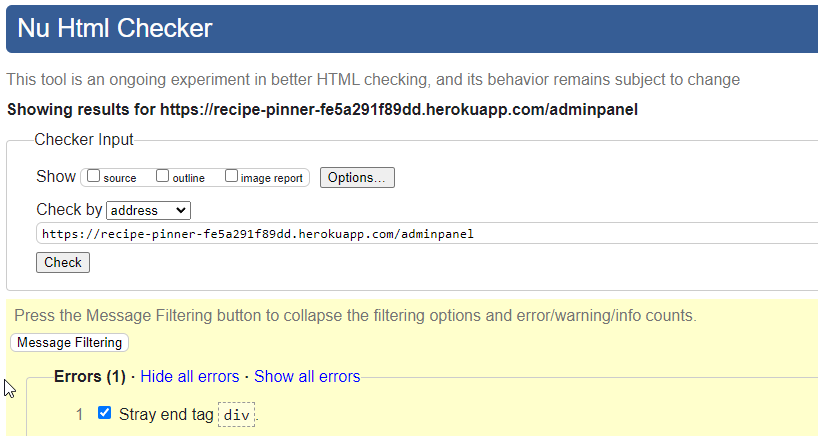
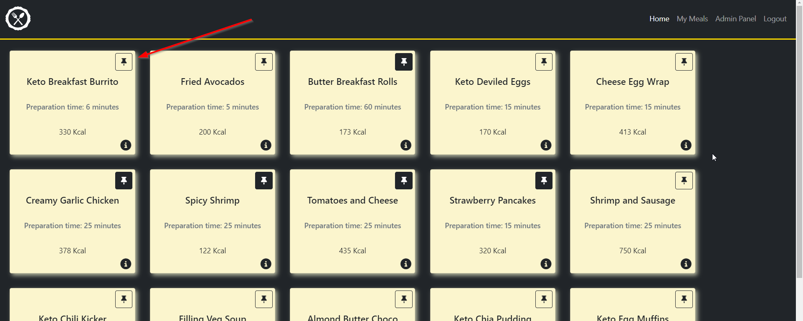
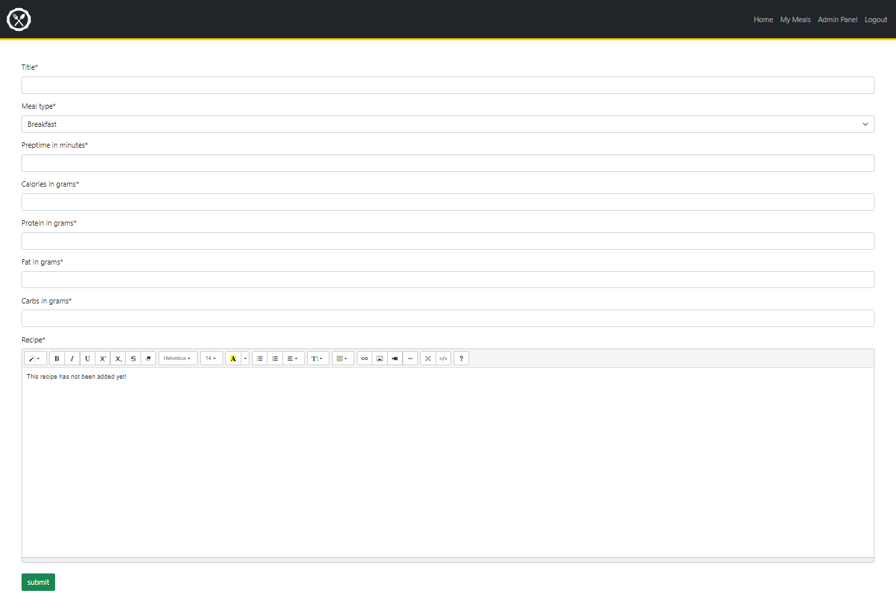
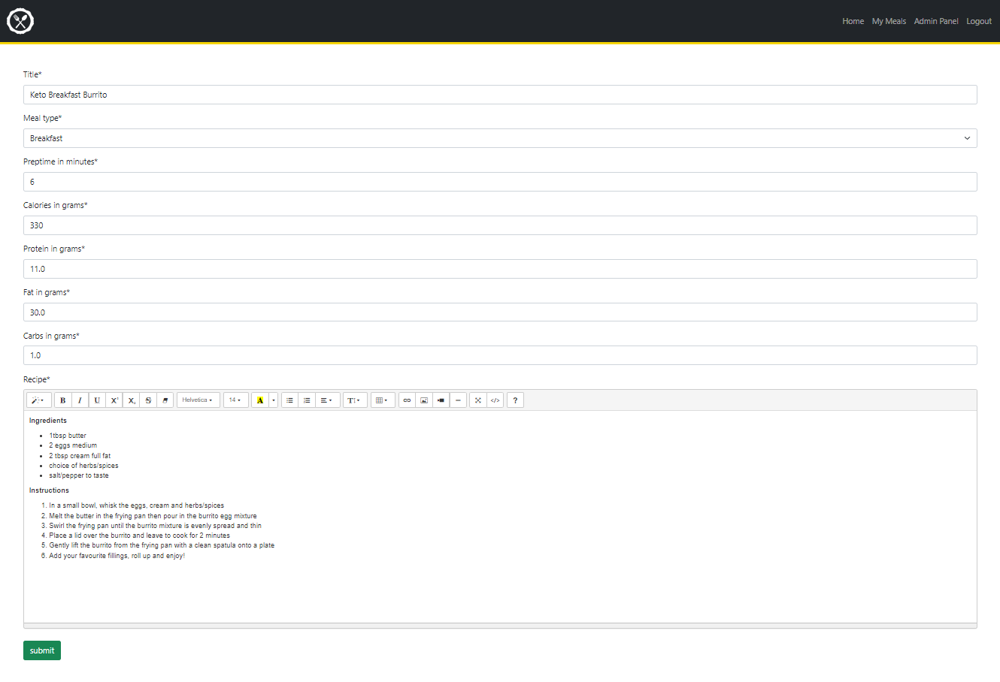

# Testing


## [HTML Validator](https://validator.w3.org/)

HTML was validated by copying the page source and pasting into the validator.

- <details>
  <summary>Index Results</summary>
  There are some errors showing in the HTML Checker that should be fixed in future iterations. 

    
  </details>

- <details>
  <summary>Home Results</summary>

  
  </details>

- <details>
  <summary>My Meals Results</summary>

  
  </details>

- <details>
  <summary>Register Results</summary>

  
  </details>

- <details>
  <summary>Login Results</summary>

  
  </details>

- <details>
  <summary>Admin Panel Results</summary>

  
  </details>

- <details>
  <summary>Admin Create Results</summary>

  
  </details>

- <details>
  <summary>Admin Edit Results</summary>

  
  </details>
  - <details>
  <summary>Admin Edit Results</summary>


## [CSS Validator](https://jigsaw.w3.org/css-validator/)

CSS was validated by copying the CSS file into the validator. No errors were reported. There were 220 warnings related to vendor extensions and bootstrap classes.

- Results for style.css:
  - 
  - <p>
    <a href="https://jigsaw.w3.org/css-validator/check/referer">
        
    </a>
</p>


## JavaScript Testing

JSHint was used for validating the JavaScript for the modals and email. 


## Python Testing

The project was tested for pep8 compliance using pycodestyle. [autopep8](https://pypi.org/project/autopep8/) was used to aid compliance. # noqa was used in a small number of cases where necessary. At time of writing no problems or errors were found.


## Lighthouse

The site was tested using Lighthouse in Chrome DevTools to check performance, accessibiltiy, best practices and SEO. The final testing on Lighthouse was run on incognito mode. The results are below.

<details>
<summary>Index - Not Logged In</summary>


</details>

<details>
<summary>Home - Index Logged In</summary>


</details>

<details>
<summary>My Meals</summary>


</details>

<details>
<summary>Admin Panel</summary>


</details>

<details>
<summary>Login</summary>


</details>

<details>
<summary>Signup</summary>


</details>


## Manual Testing

### User Story Testing

- As a Site User I can view the home page so that I can see the site's goal and be encouraged to sign up
<details>
<summary>Testing Results</summary>
This passes the testing because the sign up button is clearly visible and the site goal is implied by the nature of the image. 


</details>
- As a Site User I can register for an account so that I can log in to gain access to the site's features
<details>
<summary>Testing Results</summary>
This passes the testing because the registration form is clear and easy to understand and easily accessible.


</details>
- As a Site User I can log in so that I can gain access to the site's features
<details>
<summary>Testing Results</summary>
This passes the testing because the login is easy to access and clear and simple to understand. 


</details>
- As a Site User I can Log Out so that I can let someone else log in on my computer, leave myself signed out on public spaces or change accounts
<details>
<summary>Testing Results</summary>
This passes the testing because the logout option is easy to find, and simple to understand


</details>
- As a Site User I can view the Home page when logged in so that I can pin meals
<details>
<summary>Testing Results</summary>
This passes the testing because you are automatically redirected to the Home page after login



</details>

- As a Site User I can view my pinned meals so that I can see what I've saved
<details>
<summary>Testing Results</summary>
This passes the testing because the My Meals page automatically generates the list of meals you have pinned. Alternatively, pinned meals can be seen by the icon change. 


</details>

- As a Site User I can Click on the 'pin' to pin a meal-card so that it is added to "My Meals"
<details>
<summary>Testing Results</summary>
This passes the testing because clicking pin adds the meal to your meal list. A message gives confirmation when this is clicked. 


</details>

- As a Site User I can Click on the highlighted 'pin' to unpin a meal-card so that it is removed from "My Meals"
<details>
<summary>Testing Results</summary>
This passes the testing because clicking the highlighted pin removes it from your meal list. A message gives confirmation when this is clicked. 


</details>

- As a Site User I can Click on the Info button so that I can expand the Meal Card and view the recipe in more detail
<details>
<summary>Testing Results</summary>
This passes the testing because the info button, once clicked, opens a dialog displaying the detailed information. Clicking anywhere off of the dialog, or the X on the dialog, closes this. 


</details>
- As a Site User I can unpin meals on the My Meals page so that they are removed from the page, and the page automatically updates
<details>
<summary>Testing Results</summary>
This passes the testing because clicking the unpin from My Meals removes it from the meal list, and from the page. 


</details>
- As a Site Administrator I can view administrator features so that I can add, edit and remove meal cards to the site
<details>
<summary>Testing Results</summary>
This passes the testing because clicking on the Admin Panel brings up a list of the meals to review, with all CRUD functionality provided.


</details>
- As a Site Administrator I can view the meal CRUD Forms so that I can add, edit and remove meals from the site
<details>
<summary>Testing Results</summary>
This passes the testing because the add meal button takes you to a create form that is easy to use and understand. The edit button takes you to an edit form that is easy to use and understand. The delete button removes the meal, and gives confirmation of this action. 





</details>
- As a Developer I can create a model for the Meal database so that it is available for administrators to add meals
<details>
<summary>Testing Results</summary>
This passes the testing because we can see in the admin panel that this model is complete and working as intended.


</details>


- As a Developer I can create a model for the Pinned Meal database for each user so that we can generate a list of pinned meals for each user
<details>
<summary>Testing Results</summary>
This passes the testing because we can see in the admin panel that this model is complete and working as intended.


</details>
- As a Developer I can automatically generate a list of a User's pinned meals so that when they go to the "My Meals" page it only displays the meals they have pinned
<details>
<summary>Testing Results</summary>
This passes the testing because the My Meals are automatically generated on the My Meals page. 


</details>


## Browser Compatibility
The website was tested on:
- Chrome Version 106.0.5249.119
- Firefox Version 106.0.1
- Edge Version 106.0.1370.52
- Safari iOS Version 15.6.1


## Bugs

### Fixed Bugs

- Bug:
  - **Issue:** Favicon not appearing on site
  - **Description:** Favicon was not appearing on the deployed site
  - **Fix:** Make a link in the head to reference the favicon

- Bug:
  - **Issue:** Static files not loading on deployed site
  - **Description:** Static files were not loading because they were not linked properly through cloudinary
  - **Fix:** Removed debug from settings.py and used direct link to cloudinary file for image in css file

- Bug:
  - **Issue:** Summernote recipe box malfunctioning
  - **Description:** In the info dialog, the recipe was appearing with html tags as opposed to rendering as html
  - **Fix:** added Safe filter to recipe box

- Bug:
  - **Issue:** forEach loop not working
  - **Description:** forEach loop in the javascript returning "cannot read properties of undefined"
  - **Fix:** used ```[...]``` functionality to parse it into an array

- Bug:
  - **Issue:** Removing meals redirecting incorrectly
  - **Description:** My Meals unpin button redirecting to index page
  - **Fix:** Added code ```return redirect(reverse(request.GET.get("redirect")``` to views for remove pin


### Known Bugs

There are currently no known bugs.